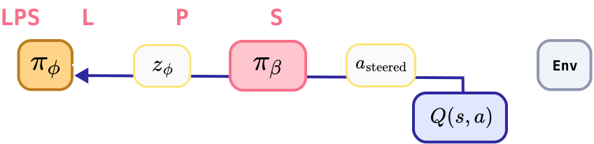

<div align="center">

# Latent Policy Steering

</div>

[](https://arxiv.org/abs/2603.05296)
[](https://huggingface.co/collections/jellyho/droid-dataset)
[](https://jellyho.github.io/LPS/)


## 📰 News
- [2026/03/06] [LPS](https://arxiv.org/abs/2603.05296) is now on arXiv.
- [2026/03/05] We release the code of LPS.

<hr />

<p align="center">
  <a href="https://jellyho.github.io/LPS/">
    
  </a>
</p>


## Overview
**Latent Policy Steering (LPS)** is a robust offline reinforcement learning framework for robotics that resolves the brittle trade-off between return maximization and behavioral constraints. Instead of relying on lossy proxy latent critics, LPS directly optimizes a latent-action-space actor by backpropagating original-action-space Q-gradients through a differentiable one-step MeanFlow policy. This architecture allows the original critic to guide end-to-end optimization without proxy networks, while the MeanFlow policy serves as a strong generative prior. As a result, LPS works out-of-the-box with minimal tuning, achieving state-of-the-art performance across OGBench and real-world robotic tasks.

## OGBench

### Installation
```bash
# For OGBench Experiments
conda create -n lps python=3.10
pip install -r requirements.txt
```

### Run Experiments
```bash
sh lps_ogbench.sh agent_naem task_name task_num alpha seed

# Examples - LPS
sh lps_ogbench.sh lps cube-single-play 1 1.0 100
sh lps_ogbench.sh lps cube-double-play 1 1.0 100
sh lps_ogbench.sh lps scene-play 1 1.0 100
sh lps_ogbench.sh lps puzzle-3x3-play 1 1.0 100
sh lps_ogbench.sh lps puzzle-4x4-play 1 1.0 100

# Exampels - QC-FQL
sh lps_ogbench.sh qcfql cube-single-play 1 30.0 100
sh lps_ogbench.sh qcfql cube-double-play 1 3.0 100
sh lps_ogbench.sh qcfql scene-play 1 1.0 100
sh lps_ogbench.sh qcfql puzzle-3x3-play 1 3.0 100
sh lps_ogbench.sh qcfql puzzle-4x4-play 1 10.0 100
```

## DROID

### Installation

Due to the mujoco-related version conflict, we need to use a separate python environment for DROID training / inference.

#### 1. Create Environment
```bash
# For DROID Experiments
conda create -n lps_droid python=3.10

# Install LPS for DROID
pip install -r requirements_droid.txt
```

#### 2. Install DROID

We have made some chage on DROID repo, so we recommend you to use our forked DROID repo.

```bash
git clone https://github.com/jellyho/droid.git
cd droid
git submodule sync
git submodule update --init --recursive
```

Follow the [instruction](https://droid-dataset.github.io/droid/software-setup/host-installation.html#configuring-the-laptopworkstation) to install DROID.

Make sure you set the server-side DROID setup ready.

#### 3. Downgrade Numpy

There could be some warning, but please ignore.
```bash
pip install 'numpy<2'
```

### Collect the data (hdf5 format)

Run droid_teleop.py collect demonstration as hdf5 format.

We assume that the dataset saved as

```text
droid_dataset_dir/
├── task_1/
│   ├── success/
│   │   ├── trajectory_0.hdf5
│   │   ├── trajectory_1.hdf5
|   |   └── ...
│   ├── failure/
│   │   ├── trajectory_7.hdf5
│   │   ├── trajectory_9.hdf5
|   |   └── ...
├── task_2/
│   ├── success/
|   |   └── ...
│   ├── failure/
|   |   └── ...
└── ...
```

### Train LPS using DROID dataset

```bash
sh lps_droid.sh task_name droid_dataset_dir seed

# Example
sh lps_droid.sh task_2 ~/droid_dataset_dir 100
```

### Evaluate LPS on DROID

We again assuming that you installed DROID on the same python environment you installed LPS.

```bash
sh lps_droid_eval.sh checkpoint_dir checkpoint_step

# Example
sh lps_droid_eval.sh /home/rllab2/jellyho/droid_ckpts/LPS/LPS_TEST_1 10000
```


## Acknowledgments
This codebase is built on top of [Reinforcement Learninig with Aciton Chunking](https://github.com/ColinQiyangLi/qc). Referred DiT implementaion from [MeanflowQL](https://github.com/HiccupRL/MeanFlowQL)

## Citation

If you find this work useful, please consider citing:
```bibtex
@misc{im2026latentpolicysteeringonestep,
      title={Latent Policy Steering through One-Step Flow Policies}, 
      author={Hokyun Im and Andrey Kolobov and Jianlong Fu and Youngwoon Lee},
      year={2026},
      eprint={2603.05296},
      archivePrefix={arXiv},
      primaryClass={cs.RO},
      url={https://arxiv.org/abs/2603.05296}, 
}
```
